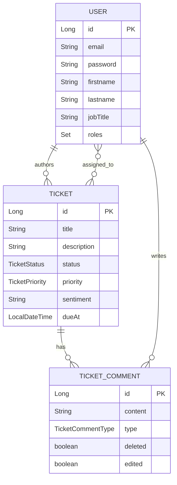
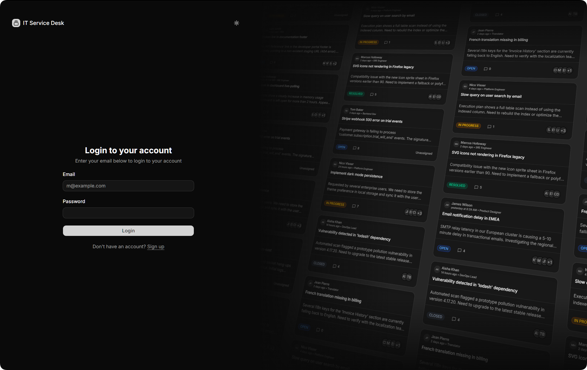
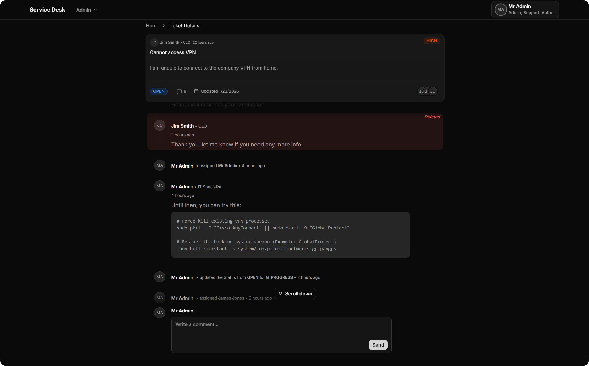
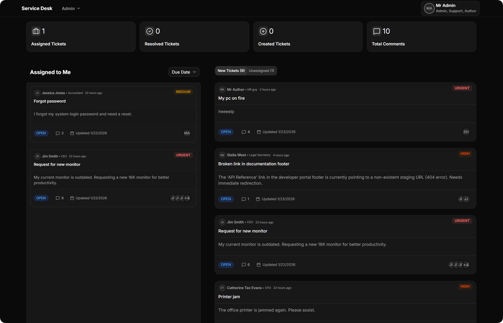

# IT Service Desk - Full Stack Project

> Full Stack Developer Training 2026 - Final Project @CNFPC

## Project Overview

This is a Full Stack application developed as the final project for the Full Stack Developer Training 2026. The application is a simplified **IT Service Desk** ticketing system that allows users to report bugs/issues and administrators to manage them.

**Key Features:**
*   **User Role:** Create tickets with Subject, Description, and Urgency. Track ticket status.
*   **Admin Role:** View all tickets, update their status (e.g., Open -> Solved), and prioritize work.
*   **AI Integration:** Includes an optional "Sentiment Detector" that analyzes ticket descriptions to automatically flag urgency or sentiment.
*   **Custom UI:** Built with **shadcn/ui** components, featuring extensive custom styling to ensure a unique and premium look.

## Setup Instructions

### Prerequisites
*   Java JDK 21
*   Node.js (v20+ recommended)
*   PostgreSQL installed and running locally
*   Maven (wrapper included)

### Database Setup
1.  Ensure your PostgreSQL service is running.
2.  Create a database named `service_desk`.
    *   *Note: Using Docker is also an option if you prefer.*
3.  Update `backend/cnfpc_full_stack_project_assignment/src/main/resources/application.properties` if your credentials differ from the defaults:
    ```properties
    spring.datasource.url=${DATABASE_URL:jdbc:postgresql://localhost:5432/service_desk}
    spring.datasource.username=${DATABASE_USERNAME:postgres}
    spring.datasource.password=${DATABASE_PASSWORD:root}
    ```

### Backend Setup
1.  Navigate to the backend directory:
    ```bash
    cd backend/cnfpc_full_stack_project_assignment
    ```
2.  Run the application using Maven Wrapper:
    ```bash
    ./mvnw clean spring-boot:run
    ```
    *   *Windows users:* `.\mvnw.cmd clean spring-boot:run`

The backend will start on `http://localhost:8080`.
*   **Swagger API Docs:** `http://localhost:8080/docs`

### Frontend Setup
1.  Navigate to the frontend directory:
    ```bash
    cd frontend
    ```
2.  Install dependencies:
    ```bash
    npm install
    ```
3.  Start the development server:
    ```bash
    npm run dev
    ```

    *   *Note:* If your backend is running on a different URL or port (default is `http://localhost:8080`), you can specify it by creating a `.env` file in the `frontend` directory or setting the environment variable:
        ```bash
        VITE_API_URL=http://your-backend-url:port npm run dev
        ```

The frontend will start on `http://localhost:5173` (or the port shown in your terminal).

## Technologies Used

### Backend
*   **Java 21**
*   **Spring Boot 4.0.1**
*   **Spring Data JPA** (Hibernate)
*   **Spring Security** (JWT Authentication)
*   **PostgreSQL** (Database)
*   **Google GenAI** (Gemini integration for Sentiment Analysis)
*   **SpringDoc OpenAPI** (Swagger Documentation)

### Frontend
*   **React 19**
*   **TypeScript**
*   **Vite**
*   **TailwindCSS** (v4)
*   **Shadcn/ui** (Component Library - with custom styling)
*   **React Router Dom**
*   **Lucide React** (Icons)

## Features & Implementation Details

### Authentication & Authorization
*   Secure password handling (BCrypt).
*   Role-Based Access Control (RBAC) with `USER` and `ADMIN` roles.
*   JWT-based stateless authentication.

### API Documentation
*   **Swagger UI:** The full interactive API documentation is available at `http://localhost:8080/docs` when the backend is running.
*   **Testing:** A [Bruno](https://www.usebruno.com/) collection is available in the `/requests` folder. You can import this folder into the Bruno app to test API endpoints directly.

#### Key Endpoints Table
Below is a high-level overview of the main API resources.

| Method | Endpoint | Description | Roles |
| :--- | :--- | :--- | :--- |
| **Auth** | | | |
| `POST` | `/api/auth/login` | Login and retrieve JWT | Public |
| `POST` | `/api/auth/register` | Register a new user account | Public |
| **Tickets** | | | |
| `GET` | `/api/tickets` | List tickets (with filters) | User, Support, Admin |
| `POST` | `/api/tickets` | Create a new ticket | User |
| `GET` | `/api/tickets/{id}` | Get ticket details | User (own), Support, Admin |
| `PUT` | `/api/tickets` | Update ticket details | User (own), Admin |
| `POST` | `/api/tickets/comment` | Add a comment to a ticket | User, Support, Admin |
| `POST` | `/api/tickets/{id}/assign/{uid}` | Assign ticket to support user | Support, Admin |
| **Users** | | | |
| `GET` | `/api/users` | List all users | Admin |
| `GET` | `/api/users/{id}` | Get user profile | User |
| `PUT` | `/api/users` | Update own profile | User |
| `PUT` | `/api/users/{id}/password` | Update password | User |

### Database Design
The project uses a relational database model with PostgreSQL.

**Key Relationships:**
*   **User** 1 -- * **Ticket** (Author)
*   **User** * -- * **Ticket** (Assignees)
*   **Ticket** 1 -- * **TicketComment**

**Entity Relationship Diagram:**



#### Entities Breakdown
*   **User:** Represents system users (Admin, Employee, etc.). Holds authentication data and profile info.
*   **Ticket:** The core entity representing an issue. Contains status, priority, and sentiment analysis results.
*   **TicketComment:** Comments added to a ticket. Can be standard comments or audit log entries (types).

*(Detailed schema can be inspected via the entity classes in `backend/.../entity`)*

### AI Integration
The application processes ticket descriptions using Google's Gemini API to determine sentiment and suggest urgency levels.

**Configuration Required:**
To use this feature, you must provide your own API key and enable the service.
1.  Obtain an API key from [Google AI Studio](https://aistudio.google.com/).
2.  Set the following properties in `application.properties` or as environment variables:

    ```properties
    # Enable the integration (default: false)
    gemini.enabled=true
    # Set your API Key
    gemini.api.key=YOUR_ACTUAL_API_KEY_HERE
    ```
    *Environment Variables:* `GEMINI_ENABLED=true` and `GEMINI_API_KEY=...`

--- 

---
 
--- 

### Screenshots for the lazy



